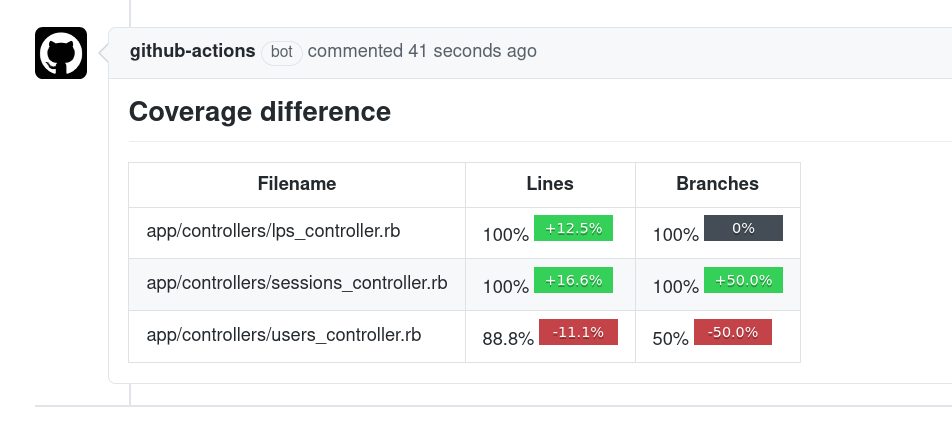

# SimpleCov Resultset Diff

Creates a comment inside your Pull-Request with the difference between two SimpleCov resultset files.



## Setup

### SimpleCov configuration

Ensure you have [SimpleCov](https://github.com/simplecov-ruby/simplecov) setup in your test framework.
You'll also need to [configure SimpleCov](https://github.com/simplecov-ruby/simplecov#configuring-simplecov) to use the [branch coverage](https://github.com/simplecov-ruby/simplecov#branch-coverage-ruby--25) strategy:

This code will need to be on your your pull-request head branch _and_ your base branch, so it's recommended that you first merge this change before adding this action to your project.

### Resultset available to git (optional)

If you ensure your `.gitignore` file is not ignoring the `.resultset.json` file, you can skip running your test twice and just use the resultset file from the base branch.

Example:
```.gitignore
# ignore simplecov assets, but not the resultset
my-app/coverage/**/*
!my-app/coverage/.resultset.json
```

## Usage

To use this Github action, in your steps you may have:

```yml
uses: kzkn/simplecov-resultset-diff-action@v1
with:
  base-resultset-path: '/path/to/my/.resultset.json'
  head-resultset-path: '/path/to/my/.resultset.json'
  token: ${{ secrets.GITHUB_TOKEN }}
```

## Inputs

| Inputs          | Required | Default | Description                                                                                   |
|-----------------|----------|---------|-----------------------------------------------------------------------------------------------|
| base-stats-path | true     |         | Path to the SimpleCov generated ".resultset.json" file from the base branch.                  |
| head-stats-path | true     |         | Path to the SimpleCov generated "resultset.json" file from the head branch.                   |
| token           | true     |         | Github token so the package can publish a comment in the pull-request when the diff is ready. |

## Usage example

If you want to compare the coverage difference between your base branch and your pull-request head branch.

You'll need to run your test and collect coverage for the head branch:

```yml
on:
  pull_request:

jobs:
  build-head:
    name: 'Build head'
    runs-on: ubuntu-latest
    steps:
    - uses: actions/checkout@v3
    - uses: ruby/setup-ruby@v1
      with:
        bundler-cache: true
    - name: Run test
      run: bundle exec rspec
```

Then we will use the Github Actions feature called "[artifacts](https://help.github.com/en/actions/automating-your-workflow-with-github-actions/persisting-workflow-data-using-artifacts)" to store that `.resultset.json` file.

```yml
    - name: Upload coverage report
      if: always()
      uses: actions/upload-artifact@v3
      with:
        name: head-result
        path: ./**/coverage/.resultset.json
```

Now you can do the exact same thing, but for the base branch. Note the checkout step!

```yml
  build-base:
    name: 'Build base'
    runs-on: ubuntu-latest
    steps:
    - uses: actions/checkout@v3
      with:
        ## Here we do not checkout the current branch, but we checkout the base branch.
        ref: ${{ github.base_ref }}
    - uses: ruby/setup-ruby@v1
      with:
        bundler-cache: true
    - name: Run test
      run: bundle exec rspec
    - name: Upload coverage report
      if: always()
      uses: actions/upload-artifact@v3
      with:
        name: base-result
        path: ./**/coverage/.resultset.json
```

Now, in a new job we can retrieve both of our saved resultset from the artifacts and use this action to compare them.

```yml
  compare:
    name: 'Compare base & head coverages'
    runs-on: ubuntu-latest
    needs: [build-base, build-head]

    steps:
    - name: Download base artifact
      uses: actions/download-artifact@v3
      with:
        name: base-result
        path: ./base-result

    - name: Download head artifact
      uses: actions/download-artifact@v3
      with:
        name: head-result
        path: ./head-result

    - uses: kzkn/simplecov-resultset-diff-action@v1
      with:
        base-resultset-path: ./base-result/.resultset.json
        head-resultset-path: ./head-result/.resultset.json
        token: ${{ secrets.GITHUB_TOKEN }}
```

That's it! When the compare job will be executed, it will post a comment in the current pull-request with the difference between the two resultset files.

## Using the uploaded .resultset.json from the base branch

If your base branch already has a `.resultset.json` because you [made it available to git](#resultset-available-to-git-optional), you can skip running your test twice and just use the resultset file from the base branch.

Follow the same steps to run your tests on the head branch and upload the resultset file as an artifact.
Then instead of running your tests on the base branch, just locate and use the `.resultset.json` file:

> NOTE: update the `check_for_resultset` step to match your project's name and file structure

```yml
  # previous jobs are the same as above: run your tests on the head branch and upload the resultset file as an artifact

  compare:
    name: Compare Coverage
    needs: build-head
    runs-on: ubuntu-latest
    steps:
      - name: Checkout Base branch
        uses: actions/checkout@v3
        with:
          ref: ${{ github.base_ref }}

      - name: Download head artifact
        uses: actions/download-artifact@v3
        with:
          name: head-result
          path: ./head-result

      # fail quietly if there is no .resultset.json file found on the base branch
      - name: Check for resultset on base branch
        id: check_for_resultset
        run: |
          if [ ! -f "./my-app/coverage/.resultset.json" ]; then
            echo "RESULTSET_FOUND=no" >> $GITHUB_OUTPUT
            echo "::warning::No ./my-app/coverage/.resultset.json found on main branch"
          else
            echo "RESULTSET_FOUND=yes" >> $GITHUB_OUTPUT
            echo "::notice::Found ./my-app/coverage/.resultset.json on main branch"
          fi

      - uses: kzkn/simplecov-resultset-diff-action@v1
        # this should only run if there is a resultset on the main branch
        env:
          RESULTSET_FOUND: ${{ steps.check_for_resultset.outputs.RESULTSET_FOUND }}
        if: env.RESULTSET_FOUND == 'yes'
        with:
          # we use the resultset from the base branch without having to re-run the tests to generate it
          base-resultset-path: ./my-app/coverage/.resultset.json
          head-resultset-path: ./head-result/.resultset.json
          token: ${{ secrets.GITHUB_TOKEN }}
```

## Cache .resultset.json

You can use the cached resultset file for comparison. To cache the resultset file that generated from the `build-base` job, it will save the build time.

```yml
  build-base:
    name: 'Build base'
    runs-on: ubuntu-latest
    steps:
    - uses: actions/checkout@v2
      with:
        ref: ${{ github.base_ref }}

    - id: base-ref-commit
      run: echo "::set-output name=revision::`git rev-parse HEAD`"

    - name: simplecov resultset cache
      id: simplecov-resultset
      uses:  actions/cache@v2
      with:
        path: coverage/.resultset.json
        key: simplecov-resultset-${{ steps.base-ref-commit.outputs.revision }}

    - uses: ruby/setup-ruby@v1
      if: steps.simplecov-resultset.outputs.cache-hit != 'true'
      with:
        bundler-cache: true

    - name: Run test
      if: steps.simplecov-resultset.outputs.cache-hit != 'true'
      run: bundle exec rspec

    - name: Upload coverage report
      if: always()
      uses: actions/upload-artifact@v3
      with:
        name: base-result
        path: ./**/coverage/.resultset.json
```

## License

MIT
